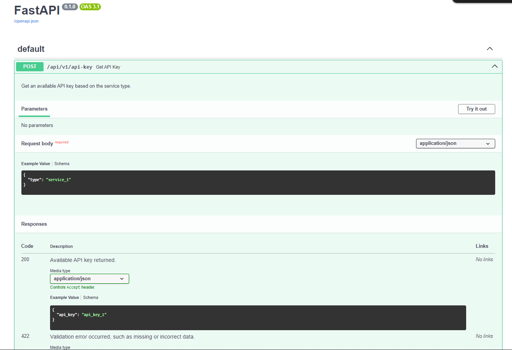

# API Key Management System

## Project Architecture
```
       +---------------+
       |    Client     |
       +---------------+
               |
               |
               v
       +-----------------+
       |   API Gateway   |
       +-----------------+
               |
               |
               v
       +----------------------------+
       | API Key Management Service |
       +----------------------------+
               |
               |
     +---------+---------+
     |                   |
     v                   v
+-----------------+ +------------------+
|   API Key 1     | |   API Key 2      |
|  1000 tokens/min| |  3000 tokens/min |
+-----------------+ +------------------+
     |                   |
     |                   |
     v                   v
+------------------+ +------------------+
| Fixed Window     | | Fixed Window     |
| Rate Limiter     | | Rate Limiter     |
| - max_tokens:    | | - max_tokens:    |
|   1000           | |   3000           |
| - window_seconds:| | - window_seconds:|
|   60             | |   60             |
+------------------+ +------------------+

```
## Design Considerations
### API Documentation ###

1. **Web Page**:
   - **Prerequisite**: Ensure that the FastAPI service is running. You can start the server using Uvicorn or Docker.

   - **Access Swagger UI**: Once the server is running, open your browser and navigate to:
     ```
     http://127.0.0.1:8000/docs
     ```
   - This will bring up the **Swagger UI**, which provides a user-friendly interface for interacting with your API.
   - **Example**
   

2. **Using `apidoc.json`**:
   - If you prefer to view the API documentation in a JSON format, you can find the `apidoc.json` file in the project root directory. This file contains structured information about the API endpoints.
   - You can use tools like **Swagger Editor**  to import and visualize the `apidoc.json` file.
   - To view it in Swagger Editor, navigate to:
     ```
     https://editor.swagger.io/
     ```
     - Then, click on **"File"** -> **"Import File"** and upload your `apidoc.json`.

### Test Report ###
- **目的**：此測試腳本旨在通過模擬題目三個服務的請求來評估 API 金鑰輪換服務。每個服務都有特定的Token消耗和延遲特性，讓我們可以監控 API 在不同條件下的請求處理能力。

- **測試假設**：
  - FastAPI 服務正在運行並可在 `http://127.0.0.1:8000/api/v1/api-key` 訪問。
  - 系統能夠處理題目需求，且超過兩個API KEY皆被消耗完畢須能回應錯誤。
  - 每個服務的行為符合定義的Token消耗和延遲值。
  - 測試的持續時間是可配置的，本次設置為 600 秒（10 分鐘）。

- **測試腳本**：
  - `load_testing.py` 該腳本使用 `aiohttp` 和 `asyncio` 來發送並發請求到   API 端點。
  - 對於 `services` 字典中定義的每個服務，腳本執行以下操作：
    - 根據服務的延遲定期發送請求。
    - 記錄從 API 收到的響應，包括響應數據或失敗狀態。

- **執行**：該腳本可以作為主程序直接執行。它會啟動指定持續時間的請求控制。

- **結果**：
  - 在執行腳本後，控制台輸出包括：
    - 每個請求發送時的時間戳。
    - 每個服務從 API 收到的響應數據。
    - 每個服務完成等待的消息。
    - **Example:**
        - **load_testing.py output:**
        ```bash
        2024-10-02 19:23:21.156469 service_3: {'api_key': 'api_key_1'}
        2024-10-02 19:23:21.157469 service_2: {'api_key': 'api_key_1'}
        2024-10-02 19:23:21.158470 service_1: {'api_key': 'api_key_1'}
        2024-10-02 19:23:31.170870 service_2 has finished waiting for 10 seconds.
        2024-10-02 19:23:31.174871 service_2: {'api_key': 'api_key_1'}
        2024-10-02 19:23:41.161995 service_1 has finished waiting for 20 seconds.
        2024-10-02 19:23:41.163023 service_2 has finished waiting for 10 seconds.
        2024-10-02 19:23:41.166753 service_1: {'api_key': 'api_key_2'}
        2024-10-02 19:23:41.168765 service_2: {'api_key': 'api_key_2'}
        2024-10-02 19:23:51.171350 service_2 has finished waiting for 10 seconds.
        2024-10-02 19:23:51.175268 service_2: {'api_key': 'api_key_2'}
        2024-10-02 19:24:01.167879 service_3 has finished waiting for 40 seconds.
        2024-10-02 19:24:01.168249 service_2 has finished waiting for 10 seconds.
        2024-10-02 19:24:01.169262 service_1 has finished waiting for 20 seconds.
        2024-10-02 19:24:01.174089 service_3: {'api_key': 'api_key_2'}
        2024-10-02 19:24:01.175097 service_1: {'api_key': 'api_key_2'}
        2024-10-02 19:24:01.177097 service_2: {'api_key': 'api_key_2'}
        2024-10-02 19:24:11.196877 service_2 has finished waiting for 10 seconds.
        2024-10-02 19:24:11.200340 service_2: {'api_key': 'api_key_2'}
        2024-10-02 19:24:21.181900 service_1 has finished waiting for 20 seconds.
        2024-10-02 19:24:21.186893 service_1: {'api_key': 'api_key_1'}
        2024-10-02 19:24:21.213427 service_2 has finished waiting for 10 seconds.
        2024-10-02 19:24:21.218423 service_2: {'api_key': 'api_key_1'}
        2024-10-02 19:24:31.229374 service_2 has finished waiting for 10 seconds.
        2024-10-02 19:24:31.233375 service_2: {'api_key': 'api_key_1'}
        2024-10-02 19:24:41.187793 service_3 has finished waiting for 40 seconds.   
        ```
  - 在執行腳本後，伺服器紀錄log包括：
    - 每個請求接收的時間戳。
    - API KEY 剩餘的Token數量。        
        - **api_key_service.log output:**
        ```bash
            2024-10-02 19:23:21,154 - app.lib.logger - INFO - API Key: api_key_1 - Remaining Tokens: 500
            2024-10-02 19:23:21,155 - app.lib.logger - INFO - API Key: api_key_1 - Remaining Tokens: 400
            2024-10-02 19:23:21,157 - app.lib.logger - INFO - API Key: api_key_1 - Remaining Tokens: 100
            2024-10-02 19:23:31,172 - app.lib.logger - INFO - API Key: api_key_1 - Remaining Tokens: 0
            2024-10-02 19:23:41,165 - app.lib.logger - INFO - API Key: api_key_2 - Remaining Tokens: 2700
            2024-10-02 19:23:41,166 - app.lib.logger - INFO - API Key: api_key_2 - Remaining Tokens: 2600
            2024-10-02 19:23:51,173 - app.lib.logger - INFO - API Key: api_key_2 - Remaining Tokens: 2500
            2024-10-02 19:24:01,172 - app.lib.logger - INFO - API Key: api_key_2 - Remaining Tokens: 2000
            2024-10-02 19:24:01,174 - app.lib.logger - INFO - API Key: api_key_2 - Remaining Tokens: 1700
            2024-10-02 19:24:01,175 - app.lib.logger - INFO - API Key: api_key_2 - Remaining Tokens: 1600
            2024-10-02 19:24:11,198 - app.lib.logger - INFO - API Key: api_key_2 - Remaining Tokens: 1500
            2024-10-02 19:24:21,184 - app.lib.logger - INFO - API Key: api_key_1 - Remaining Tokens: 700
            2024-10-02 19:24:21,217 - app.lib.logger - INFO - API Key: api_key_1 - Remaining Tokens: 600
            2024-10-02 19:24:31,231 - app.lib.logger - INFO - API Key: api_key_1 - Remaining Tokens: 500
            2024-10-02 19:24:41,190 - app.lib.logger - INFO - API Key: api_key_1 - Remaining Tokens: 0
            2024-10-02 19:24:41,191 - app.lib.logger - INFO - API Key: api_key_2 - Remaining Tokens: 2700
            2024-10-02 19:24:41,236 - app.lib.logger - INFO - API Key: api_key_2 - Remaining Tokens: 2600
  - 測試的結果將幫助識別：
    - API 是否正確返回每個服務的可用 API 金鑰。
    - API KEY 若超過限制，是否回傳另一個API KEY。

- **結果解釋**：
  - 如果 API 成功返回預期的金鑰且沒有任何失敗（狀態碼 200），則表示服務運行正常。
  - 如果返回狀態碼429，則表示API 遭受速率限制。
    - **Example**
        ```bash
        2024-10-02 19:34:12,723 - app.lib.logger - INFO - API Key: api_key_1 - Remaining Tokens: 500
        2024-10-02 19:34:13,776 - app.lib.logger - INFO - API Key: api_key_1 - Remaining Tokens: 0
        2024-10-02 19:34:14,497 - app.lib.logger - INFO - API Key: api_key_2 - Remaining Tokens: 2500
        2024-10-02 19:34:14,914 - app.lib.logger - INFO - API Key: api_key_2 - Remaining Tokens: 2000
        2024-10-02 19:34:15,376 - app.lib.logger - INFO - API Key: api_key_2 - Remaining Tokens: 1500
        2024-10-02 19:34:15,852 - app.lib.logger - INFO - API Key: api_key_2 - Remaining Tokens: 1000
        2024-10-02 19:34:16,249 - app.lib.logger - INFO - API Key: api_key_2 - Remaining Tokens: 500
        2024-10-02 19:34:16,727 - app.lib.logger - INFO - API Key: api_key_2 - Remaining Tokens: 0
        2024-10-02 19:34:17,268 - app.lib.logger - ERROR - All API keys have reached their rate limits.
  - 分析日誌以確保Token消耗符合預期速率，並且 API 能夠處理負載。

## How to run the application using Docker or Docker Compose

### Using Docker

1. Clone the repository:
   ```bash
   git clone https://github.com/yqooopy/API-Key-Rotation-Service.git
   cd your-repo-directory
2. Use Docker:
   ```bash
    docker build -t api-key-manager .
    docker run -d -p 8000:8000 api-key-manager
## How to execute unit tests

### Using pytest

1. Accessing the Docker Container:
   ```bash
   docker exec -it <container_id> bash
2. Running Unit Tests:
   ```bash
    pytest
    or detail:
    pytest -v
3. Results:
    